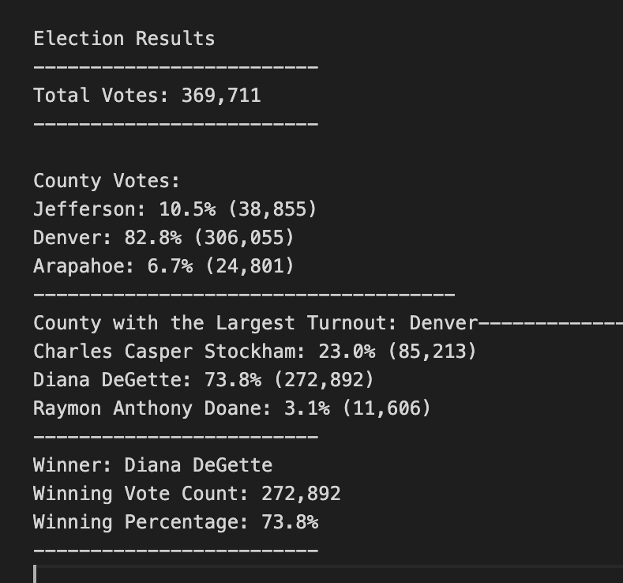

# election_analysis
*Using the power of Python to auomate the voter-counting process for a local election.*

## Project Overview:
A Colorado Board of Elections employee has given you the following task to complete the election audit of a recent local congressional election.

1. Calculate the total number of votes cast. 
2. Get a complete list of candidates who received votes. 
3. Calculate the total number of votes each candidate recieved.
4. Calculate the percentage of votes each candidate won.
5. Determine the winner of the election based on popular vote.

## Resources:
- Data Source: election_results.csv
- Software: Python 3.6.1, Visual Studio Code, 1.38.1

## Summary:
The analysis of the election show that:
- There were 269,711 votes cast in the election.
- The candidates were:
  - Candidate 1: Charles Casper Stockham
  - Candidate 2: Diana DeGatte
  - Candidate 3: Raymon Anthony Doane
- The Candidate results were:
  - Charles Casper Stockham recieved 23.0% of the vote and 85,213 number of votes.
  - Diana DeGatte recieved 73.8% of the vote and 272,892 number of votes.
  - Raymon Anthony Doane recieved 3.1% of the vote and 11,606 number of votes.
- The winner of the election was:
  - Candidate 2 (Diana DeGette), who recieved 73.8% of the vote and 272,892 number of votes.

--------------------------------

## Challenge Overview

## Overview of Election Audit:
Continuing with the success of the above election audit, the election commission has requested addition data to complete the audit:

1. The voter turnout for each county
2. The percentage of votes from each county out of the total count
3. The county with the highest turnout

## Election-Audit Results:
The analysis of the election show that:
- There were 369,711 votes cast in this congressional election
- The County resultes were:
  - Jefferson County recieved 10.5% of the vote and 38,855 number of votes.
  - Denver County recieved 82.8% of the vote and 306,055 number of votes.
  - Arapahoe County recieved 6.7% of the vote and 24,801 number of votes.
- The county with the largest number of votes was:
  - Denver County which recieved 82.8% of the vote and 306,055 number of votes.
-The Candidate results were:
  - Charles Casper Stockham recieved 23.0% of the vote and 85,213 number of votes.
  - Diana DeGatte recieved 73.8% of the vote and 272,892 number of votes.
  - Raymon Anthony Doane recieved 3.1% of the vote and 11,606 number of votes.
- The winner of the election was:
  - Diana DeGatte recieved 73.8% of the vote and 272,892 number of votes.

## Elections-Audit Summary:
One of the greatest advantage this script can offer the election commission is time saved and human error elimination. The elimination of human error is a great advantage as bias potential bias or voter count fraud can be elimated and ensure a reliable voter count for democracy. This script can be modified to be be used for other elections as the election commission sees fit. While this code is able to quickly run for a data set with 369,711 rows, further modification would be needed to support larger voter turnouts at the state and national levels.
